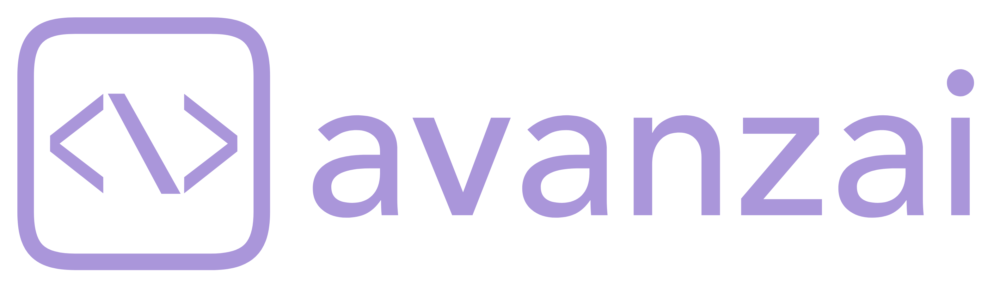

<p align="center">
  
</p>

# Avanzai

An open-source project designed for institutions to quickly build and deploy their own AI-powered financial analysis platform. This project provides a production-ready foundation and is continuously updated to incorporate the latest advancements in AI within the financial data vertical.

## Project Overview

AvanzAI is a comprehensive financial analysis platform that provides tools for:
- Real-time financial data querying
- Stock price visualization and analysis
- AI-powered financial research
- Portfolio analysis and optimization

The project consists of two main components:
1. **Frontend**: A NextJS application based on Vercel's AI chatbot template
2. **Backend**: A FastAPI application with AI agents for financial data analysis

## Frontend (avanzai-frontend)

The frontend is built with NextJS and leverages the Vercel AI SDK for conversational interfaces.

### Key Technologies

- **NextJS**: React framework with App Router for server-side rendering and components
- **Vercel AI SDK**: Unified API for generating text and building chat interfaces
- **shadcn/ui**: Component library based on Tailwind CSS and Radix UI
- **authentication**: NextAuth.js v5 for secure user authentication
- **data visualization**: Recharts for interactive charts and visualizations

### Directory Structure

- `/app`: Core application routes and layouts using the App Router
  - `/(chat)`: Chat interface components
  - `/(auth)`: Authentication pages
  - `/dashboard`: Dashboard views
  - `/data-sources`: Data source management
  - `/api`: API routes
- `/components`: Reusable React components
  - `/ui`: shadcn/ui components
- `/lib`: Utility functions and modules
  - `/api`: API client functions
  - `/db`: Database models and migrations
  - `/ai`: AI helpers and utilities
  - `/artifacts`: Artifact management
  - `/models`: Data models and types
- `/public`: Static assets

### Key Features

- Conversational financial analysis
- Interactive visualizations
- Real-time market data
- Collaborative document editing
- Responsive dashboard views
- Authentication and user profiles

## Backend (avanzai-backend)

The backend is powered by FastAPI and provides an API for financial data retrieval, analysis, and AI-powered insights.

### Key Technologies

- **FastAPI**: Modern, high-performance web framework for building APIs
- **LlamaIndex**: Framework for connecting LLMs with external data
- **OpenAI Agent SDK**: Framework for creating AI agents and assistants
- **SQLite/Supabase**: Database for storing financial data
- **OpenAI/Groq**: LLM integration for financial analysis (closed and open source)

### Directory Structure

- `az3_api_03242025.py`: Main API application with endpoints and business logic (IN CONSTRUCTION)
- `sessions/`: User session data storage
- `requirements3.txt`: Python dependencies

### Core Features

1. **Financial Data Processing**:
   - Historical price data retrieval
   - Technical analysis calculations
   - Performance metrics

2. **AI-Powered Analysis**:
   - Natural language query processing
   - Automated chart generation
   - Financial insights extraction

3. **Session Management**:
   - Persistent user sessions
   - Data caching for performance
   - Metadata tracking

4. **API Endpoints**:
   - `/get_tickers`: Extract ticker symbols from natural language queries
   - `/get_pricing_data`: Retrieve pricing data for specified tickers
   - `/process_query`: Process natural language financial queries
   - `/session_summary`: Retrieve session statistics and history

## 🛠 Getting Started


### ⚙️ Setup & Installation

1. **Clone the repository**

```bash
git clone https://github.com/GuillermoMalena/avanzai_open.git
cd avanzai_open
```

2. **Create your environment config**

```bash
cp .env.example .env
```

> Add your OpenAI, Supabase, AWS, and other API keys to the `.env` file.

3. **Start the full stack using Docker Compose**

```bash
docker-compose up --build
```

- The **frontend** (Next.js) will be available at `http://localhost:3000`
- The **backend** (FastAPI) will run at `http://localhost:8000`

### 🧪 Dev Notes

- The frontend supports hot reload via volume mounting
- Poetry is used for Python dependency management in the backend
- If you modify dependencies, update `pyproject.toml` and re-run the container

## 🗺 Coming Soon

- Real-time data integration with Polygon API
- Built-in local Yahoo Finance storage
- CI/CD deployment support
- Contribution guide and community license
